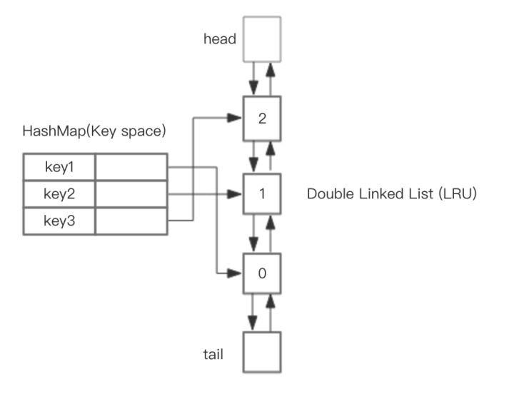

# LRU Cache
----

## Data structure
- Hash table︰The key is the keyword `key`, and the value is `*DLinkNode`, which maps to the node address in the linked list. This is used to find the corresponding cache in `O(1)` time complexity.
  
- Double linked list︰Elements near the `head` are `the most recently used`, while those near the `tail` are `the least recently used`."

## Action
Implementing LRU requires two actions:

- Get data (Get(key int)): If the key exists in the cache, retrieve the value of the key; otherwise, return -1.
- Write data (Put(key, value int)): If the key already exists, update its value. If it does not exist, insert the key-value pair into the cache. If the insertion operation causes the number of keys to exceed the capacity, the least recently used key should be evicted."

